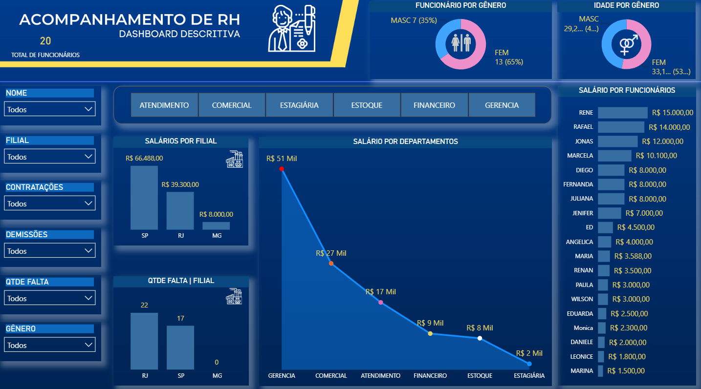

# Dashboard de RH — Power BI

Painel descritivo de pessoas em uma única tela: custo de folha, absenteísmo, headcount e perfil demográfico, filtrável por funcionário, filial, departamento, gênero e movimentação.

**Projeto de estudo com dados fictícios.** Nenhuma informação real de empresa ou de pessoa física.

## O problema

RH costuma ter os números, mas espalhados: a folha em uma planilha, o controle de faltas em outra, o quadro de pessoal em uma terceira. A pergunta que o gestor faz — qual filial está com mais falta e quanto ela custa — exige cruzar as três. Este relatório junta tudo em uma tela única, com sete filtros para recortar por qualquer ângulo.

## O que os dados mostram

| Achado | Detalhe |
|---|---|
| A gerência concentra a folha | R$ 51 mil dos cerca de R$ 114 mil da folha, perto de 45%, estão em um único departamento. |
| O RJ falta mais que SP | 22 faltas no RJ contra 17 em SP, mesmo com folha cerca de 40% menor. MG não registra faltas. |
| Quadro majoritariamente feminino | 13 das 20 pessoas (65%). A idade média feminina, 33 anos, é maior que a masculina, 29. |

## O que o painel mostra

| Indicador | Visual |
|---|---|
| Total de funcionários | Cartão |
| Funcionários por gênero | Rosca |
| Idade média por gênero | Rosca |
| Salário por funcionário | Barras horizontais, do maior para o menor |
| Salários por filial | Colunas |
| Faltas por filial | Colunas |
| Salário por departamento | Área |

Filtros: seis segmentações em lista (nome, filial, contratações, demissões, quantidade de faltas e gênero) e uma barra de botões por departamento no topo do painel.

## Modelo e medidas

A base é uma única tabela, tb_rh, com ID, nome, salário, sexo, departamento, filial, quantidade de faltas, contratações e demissões.

| Medida | Para que serve |
|---|---|
| TOTAL DE SALARIOS | Custo total da folha no recorte filtrado |
| TOTAL_FALTAS | Soma de faltas, base do indicador de absenteísmo |
| GENERO | Contagem de funcionários por gênero |
| IDADE_GENERO | Idade média por gênero |

## Decisões de construção

Tudo em uma página só, de propósito. Indicador de pessoas é consultado em reunião, e trocar de aba no meio da conversa quebra o raciocínio de quem está olhando. Os filtros ficam em coluna à esquerda, onde o olho começa a leitura, e os departamentos viram botões no topo porque são o recorte mais pedido. Os ícones de filial e gênero identificam cada visual sem que seja preciso ler o título.

## Como abrir

Baixe o arquivo Dashboard_RH.pbix e abra no Power BI Desktop. O modelo já vem com os dados importados, não é preciso configurar nenhuma conexão.

## Stack

Power BI Desktop, Power Query (M), DAX.
